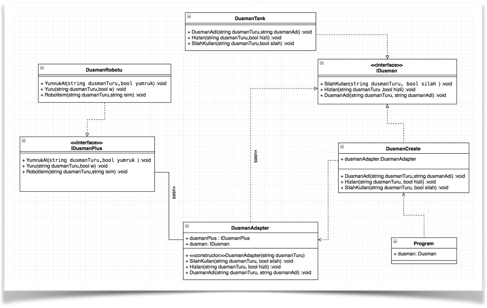

#Adapter-Pattern

Karşılıklı savaş yapılabilecek bir oyun tasarladığımızı hayal edelim. Oyunumuzda kullanacağımız düşmanlar araçlardan oluşmaktadır ve düşmanların tahmini metotları “IDusman” interface’inde tanımlanmıştır. Bu interface’i kullanarak bir “DusmanTank” aracını oluşturarak kodlamaya başladık ve bu işi bitirdik. Daha sonra bizimle aynı lokasyonda olmayan bir arkadaşımız da oyuna “DusmanRobotu” eklediğini iletti (ancak IDusman interface’inden haberi yoktu). Arkadaşımız işe yarayan etkin bir kod yazmış; hem arkadaşımızı kırmamak hem de bu işi baştan yapmamak adına yazdığı kodları kendi sistemimize HİÇ DEĞİŞTİRMEDEN adapte etmek istiyoruz. Bu robot, tanktan farklı işlevlere sahip ancak aynı zamanda bir düşman robotu. Yani yine “IDusman” interface'ini kullanmak istiyoruz (oyunumuza kolayca ekleyebilmek için aynı interface’i kullanmak zorundayız aslında). Bu noktada “Adaptör” tasarım kalıbını kullanmanız ve bu kodları en uygun şekilde birleştirmeniz istenmektedir.

**Contributor**
- [Onur Hüseyin ÇANTAY](https://github.com/onurhuseyincantay)
- [Recep ÇELİK](https://github.com/Rexulon)
